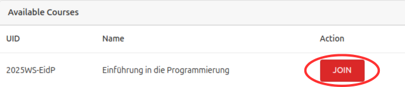
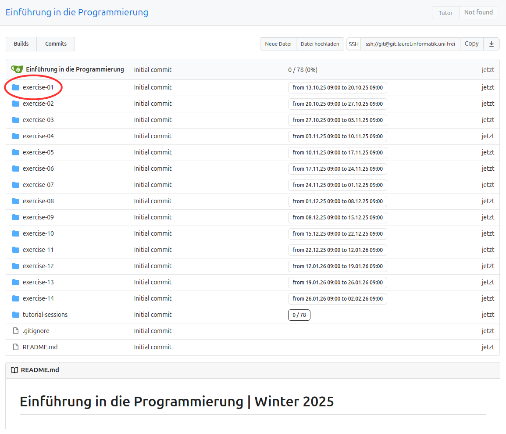
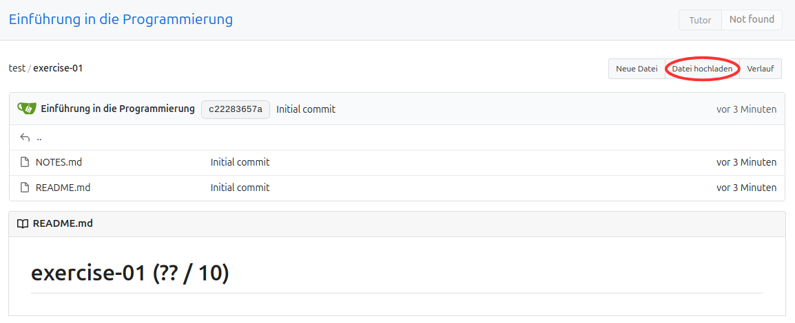
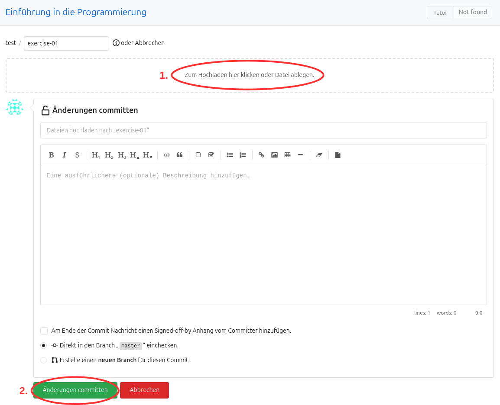
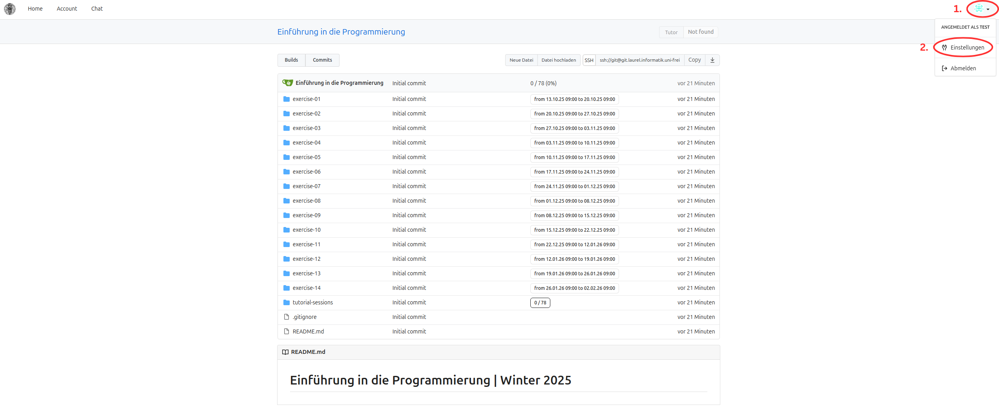
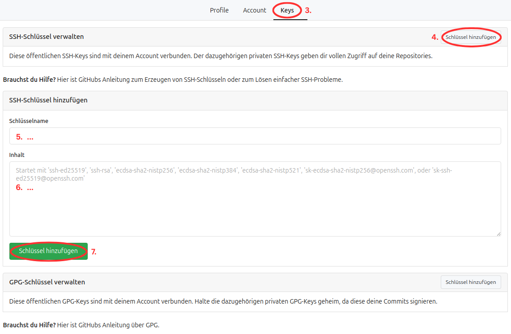
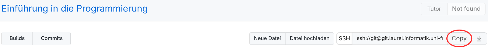
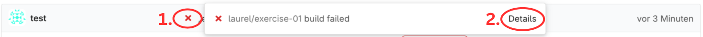

# Abgabesystem für **Einführung in die Programmierung**

## 1. Kurs beitreten

1. Öffnen Sie die Website des [Abgabesystems](https://git.laurel.informatik.uni-freiburg.de/).
2. Klicken Sie oben rechts auf **Anmelden**.
3. Melden Sie sich mit Ihrem Uni-Account (wie bei HisInOne – RZ-Account) an.
4. Treten Sie dem Kurs **2025WS-EidP Einführung in die Programmierung** bei, indem Sie auf das rote **Join** klicken.

    

---

## 2. Abgabe

Sie können Ihre Lösungen auf zwei Arten einreichen:  
– Entweder direkt über die [Website](#über-die-website-abgeben)  
– Oder (empfohlen) über [Git](#über-git-abgeben)

---

### Über die Website abgeben

1. Öffnen Sie die Website des [Abgabesystems](https://git.laurel.informatik.uni-freiburg.de/).
2. Klicken Sie oben rechts auf **Anmelden**.
3. Melden Sie sich mit Ihrem Uni-Account an.
4. Öffnen Sie den Kurs **2025WS-EidP Einführung in die Programmierung**.
5. Navigieren Sie zu dem Ordner, in dem Sie Ihre Lösung abgeben möchten.

    

6. Klicken Sie oben rechts auf **Datei hochladen**.

    

7. Ziehen Sie Ihre Dateien per Drag-and-Drop in das Feld **1.**, oder klicken Sie es an und wählen die gewünschten Dateien aus. Klicken Sie anschließend unten links auf **2.**, um die Dateien abzugeben.

    

8. Sie sollten Ihre abgegebenen Dateien nun in der Übersicht sehen.  
Achten Sie darauf, dass rechts hinter der Commit-Nachricht ein grüner Haken erscheint. Weitere Infos dazu unter [Build Server](#build-server).

---

### Über Git abgeben

Die Abgabe via Git erfordert ein einmaliges Setup, ermöglicht aber anschließend eine komfortable Abgabe direkt aus VS Code.

---

#### 🛠️ Git einmalig einrichten

1. Öffnen Sie **Visual Studio Code (VSC)**.
2. Öffnen Sie ein Terminal in VSC (```Ctrl + Shift + ` ``` oder über `Terminal → New Terminal`).
3. Installieren Sie Git und SSH mit:

    ```bash
    sudo apt install git ssh -y
    ```

4. Erzeugen Sie ein SSH-Schlüsselpaar:

    ```bash
    ssh-keygen
    ```

5. Drücken Sie einfach **Enter**, um die Standardpfade zu verwenden.  
Der Schlüssel wird unter `~/.ssh/id_rsa` und `~/.ssh/id_rsa.pub` gespeichert.

6. Zeigen Sie Ihren öffentlichen Schlüssel an:

    ```bash
    cat ~/.ssh/id_rsa.pub
    ```

    Die Ausgabe sieht etwa so aus:

    ```
    ssh-rsa AAAAB3NzMC+iS[...]wBlhd3n9VPCG0p= user@system
    ```

    Kopieren Sie den gesamten Text (die Shortcuts können sich nach Betriebsystem unterscheiden, `Rechtsklick -> Copy` geht aber immer ;) ).

7. Öffnen Sie das [Abgabesystem](https://git.laurel.informatik.uni-freiburg.de/), melden Sie sich an und öffnen Sie den Kurs **2025WS-EidP Einführung in die Programmierung**.
8. Klicken Sie oben rechts auf das Profilbild → **Einstellungen**.

    

9. Navigieren Sie zum Reiter **Keys** → Klicken Sie bei **SSH-Schlüssel verwalten** auf **Schlüssel hinzufügen**.  
Geben Sie bei **Name** eine Bezeichnung ein, und fügen Sie den kopierten Schlüssel unter **Inhalt** ein.  
Klicken Sie anschließend auf **Schlüssel hinzufügen**.

    

10. Gehen Sie zurück zum Repository (über **Home** → Kurs öffnen).
11. Kopieren Sie den SSH-Link des Repositories über den **Copy**-Button.

    

12. Zurück in VSC: Navigieren Sie im Terminal zu einem Ordner, in dem Sie das Repository speichern möchten.

    Wichtige Terminalbefehle:
    - `ls` → listet Inhalte im aktuellen Verzeichnis
    - `cd dirXYZ` → wechselt in das Verzeichnis `dirXYZ`
    - `cd ..` → geht ein Verzeichnis nach oben

13. Klonen Sie Ihr Repository (ersetzen Sie `<ssh-url>` durch die kopierte URL):

    ```bash
    git clone <ssh-url>
    ```

    Danach sollte ein neues Verzeichnis mit Ihrem Kürzel erscheinen – das ist Ihr lokales Repository.

14. Konfigurieren Sie Git mit Ihrem Namen und Ihrer E-Mail-Adresse:

    ```bash
    git config user.name "Ihr Name"
    git config user.email "your@mail.com"
    git config pull.rebase true
    ```

---

#### 🔄 Workflow mit Git

Alle folgenden Befehle führen Sie **im Terminal im Verzeichnis Ihres Repos** aus:

1. **Lokalen Stand aktualisieren**

    ```bash
    git status
    ```

    Falls Änderungen vorhanden sind, zuerst committen:
    ```bash
    git add <dateiname>
    git commit -m "Nachricht"
    ```  
    Danach:

    ```bash
    git pull
    ```

2. **Änderungen hochladen**

    ```bash
    git add <dateiname>
    git commit -m "Nachricht"
    git pull
    git push
    ```

---

#### 🧠 Merkhilfe: Git-Workflow

```bash
git pull
# ... Dateien verändern ...
git add <dateien>
git commit -m "Nachricht"
git pull
git push
```

## Build Server

Nachdem Sie Ihre Lösung hochgeladen haben, überprüft der Build-Server automatisch, ob Ihr Code den vorgegebenen Stilrichtlinien (z. B. *flake8*) entspricht und ob Sie in der Datei **NOTES.md** Ihre aufgewendete Zeit eingetragen haben.

War der Build erfolgreich, erscheint ein grüner Haken neben Ihrer Commit-Nachricht auf der Abgabeplattform.

Bei einem fehlgeschlagenen Build wird stattdessen ein roter Haken angezeigt. Durch einen Klick auf den roten Haken **1.** und dann einen Klick auf **2.** Details, erhalten Sie eine detaillierte Fehlermeldung.



Der Build-Check muss erfolgreich abgeschlossen werden – Abgaben, die diesen Schritt nicht bestehen, werden mit **0 Punkten** bewertet.

Sie können Ihre Dateien beliebig oft hochladen. Bewertet wird stets der Stand zum Zeitpunkt der Deadline. So können Sie also ohne Probleme Ihre Dateien abgeben und nachschauen ob der Build durchlief, falls nicht, können Sie anhand der Fehlermeldungen korrigieren und erneut hochzuladen.
